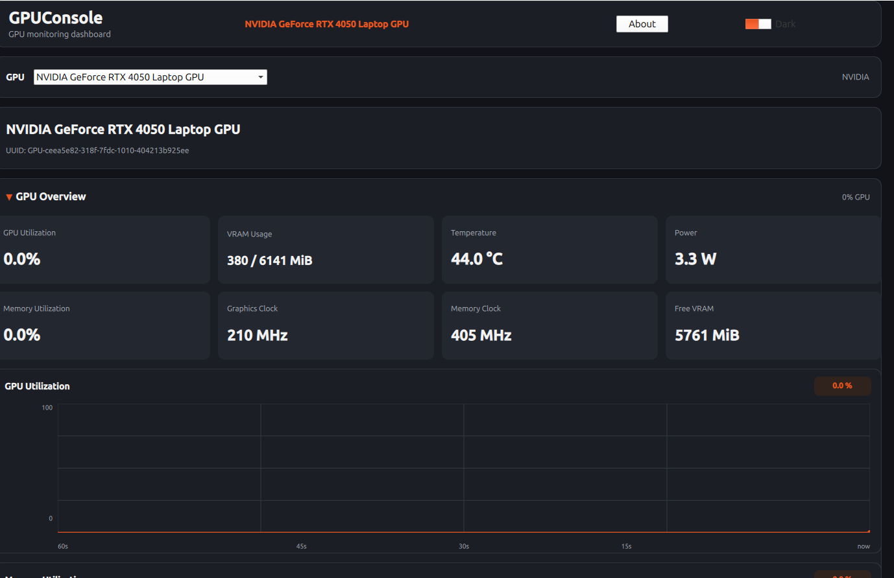

# GPUConsole

NVIDIA GPU monitoring dashboard for Linux, built with C++17 and Qt 6.

GPUConsole provides a desktop interface for monitoring NVIDIA GPU hardware and real-time GPU activity using NVIDIA Management Library (NVML).



## Features

- NVIDIA GPU detection
- GPU utilization monitoring
- VRAM usage and available VRAM
- Memory utilization
- GPU temperature
- Power usage
- Power limit
- Graphics clock
- Memory clock
- Fan speed
- Performance state
- PCIe generation and link width
- NVIDIA driver version
- CUDA driver version
- Running GPU processes
- Real-time monitoring graphs
- GPU information dashboard
- Dark desktop interface
- Native Linux desktop application

## Requirements

- Linux
- NVIDIA GPU
- NVIDIA proprietary driver with NVML support
- Qt 6
- C++17 compiler
- CMake

GPUConsole currently targets NVIDIA GPUs.

## NVIDIA Support

GPUConsole uses NVIDIA Management Library (NVML) to obtain GPU information.

The application does not rely on hard-coded GPU values. Monitoring data is obtained from the NVIDIA driver through NVML.

## Build From Source

Clone the repository:

```bash
git clone https://github.com/userusv/GPUConsole.git
cd GPUConsole
